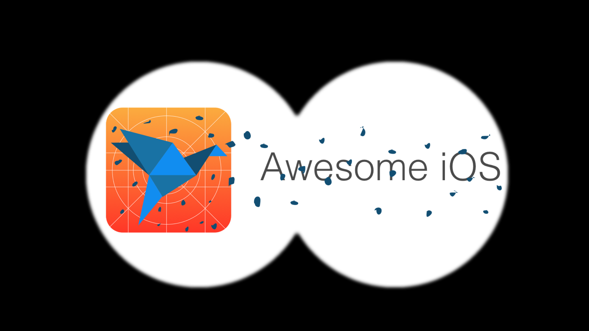

# Watcher
> Awesome iOS scrapper

[![Go Version][swift-image]][swift-url]
[![Build Status][travis-image]][travis-url]
[![License][license-image]][license-url]

## Installation

`make install`

## Release History

* 0.0.1
    * Work in progress

## Contribute

We would love for you to contribute to **Watcher**, check the ``LICENSE`` file for more info.

## Meta

Vinicius Souza – [@iamvsouza](https://twitter.com/iamvsouza) – hi@vsouza.com

Distributed under the MIT license. See ``LICENSE`` for more information.

[https://github.com/yourname/github-link](https://github.com/dbader/)

[swift-image]:https://img.shields.io/badge/go-1.6-orange.svg
[swift-url]: https://swift.org/
[license-image]: https://img.shields.io/badge/License-MIT-blue.svg
[license-url]: LICENSE
[travis-image]: https://img.shields.io/travis/dbader/node-datadog-metrics/master.svg?style=flat-square
[travis-url]: https://travis-ci.org/dbader/node-datadog-metrics
[codebeat-image]: https://codebeat.co/badges/c19b47ea-2f9d-45df-8458-b2d952fe9dad
[codebeat-url]: https://codebeat.co/projects/github-com-vsouza-awesomeios-com
